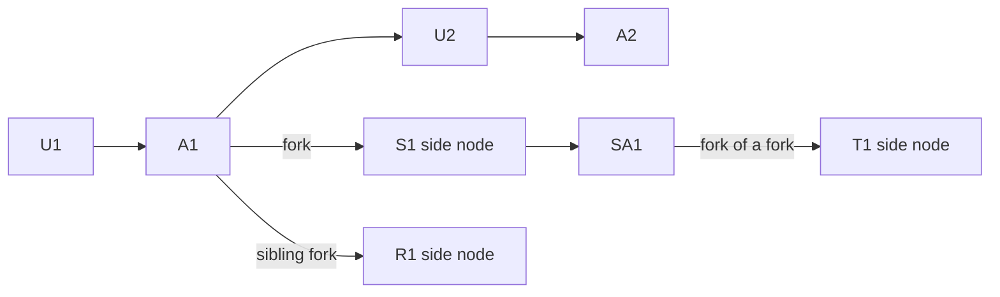

# Tangents

A local-first chat app for Claude. Conversations are a tree: a **center node** holds the main thread, and **side nodes** are tangents forked off a specific assistant message. A side node can fork further side nodes.

The context sent to the API for any message is only the path from the root to that message. The center node never sees side-node tokens, and a side node never sees messages added to its parent after the fork.

No login, no accounts. The Anthropic API key stays on the server.

## Run

```bash
cd backend
cp .env.example .env   # then add your key
uv run uvicorn app.main:app --reload
```

```bash
cd frontend
npm install
npm run dev
```

The UI is at [http://127.0.0.1:5173](http://127.0.0.1:5173). Vite proxies `/api` to the backend on port 8000.

`get_context` walks `parent_id` back to the root. Three compaction cases in `backend/tests/test_context.py` are skipped, with `expected = ...  # TODO` still to fill in. A failed turn is rolled back, so the user message is not kept.

## Environment

Copy `backend/.env.example` to `backend/.env`. The file is gitignored.

| Variable | Required | Meaning |
| --- | --- | --- |
| `ANTHROPIC_API_KEY` | to call Claude | Read on the server only. Never sent to the browser. The server still starts without it and fails the call with a clear error. |
| `ANTHROPIC_MODEL` | no | Optional fallback. The header picker chooses the model for each turn and is remembered in the browser. Current choices: Sonnet 5.5, Opus 5.5, Fable 5.1, Haiku 4.5. |
| `MAX_TOKENS` | no | Output token cap. Defaults to 4096. |
| `CACHE_TTL` | no | `5m` (default) or `1h`. Anything else refuses to start. |
| `COMPACT_TRIGGER_TOKENS` | no | Input-token trigger for server-side compaction. Defaults to 150000. Values under 50000 refuse to start. |
| `WEB_SEARCH_MAX_USES` | no | Cap on web searches per request. Defaults to 5. Values under 1 refuse to start. |
| `WEB_FETCH_MAX_USES` | no | Cap on page fetches per request. Defaults to 5. Values under 1 refuse to start. |
| `WEB_FETCH_MAX_CONTENT_TOKENS` | no | Approximate token cap for one fetched page. Defaults to 20000. Values under 1 refuse to start. |
| `WEB_SEARCH_BLOCKED_DOMAINS` | no | Optional comma-separated domains that never appear in search results. |

The database is `backend/tangents.db`.

## The fork rule



Context for a message is the walk of `parent_id` back to the root, reversed. Nothing else is sent.

- S1 sees U1, A1, S1. It does not see U2 or A2, which were added on the center node after the fork.
- R1 sees U1, A1, R1. It does not see S1.
- T1 sees U1, A1, S1, SA1, T1.
- The center node never sees S1, R1, or T1.

A side node's first message has `parent_id` set to the assistant message it was forked from. That is the whole snapshot: later messages on the parent are not on the path.

## Schema

SQLite, one file, via `sqlite3`. Message `content` is a JSON array of raw Anthropic content blocks, stored as returned and sent back unchanged. User messages are stored as `[{"type": "text", "text": "..."}]`.

```sql
conversations (
  id TEXT PRIMARY KEY,
  goal TEXT,            -- editable pinned goal; NULL until the center node's first user message
  created_at TEXT
)

threads (
  id TEXT PRIMARY KEY,
  conversation_id TEXT REFERENCES conversations(id),
  parent_thread_id TEXT REFERENCES threads(id),  -- NULL for the center node
  fork_message_id TEXT REFERENCES messages(id),  -- NULL for the center node
  title TEXT,
  created_at TEXT
)

messages (
  id TEXT PRIMARY KEY,
  parent_id TEXT REFERENCES messages(id),  -- NULL for the first message
  role TEXT,                               -- "user" or "assistant"
  content TEXT,                            -- JSON content blocks
  thread_id TEXT REFERENCES threads(id),
  created_at TEXT,
  is_note INTEGER,                         -- 1 for a merge-back note
  usage TEXT                               -- JSON usage object, assistant rows only
)
```

Within a thread, messages form a line. A new message's `parent_id` is the thread's latest message, or `fork_message_id` when a side node is still empty, or NULL for the first message of the center node.

The pinned goal defaults to the text of the center node's first user message, and only while `goal` is still NULL. Editing it does not change the transcript. Compaction summaries are instructed to restate the current goal.

After a node's first reply succeeds, its title is a 2–6 word topic name from Claude Haiku 4.5 (`claude-haiku-4-5`), taken from the first 400 characters of that node's first user message and the first 400 characters of the reply. The name has to agree with the reply, so it cannot state a fact the reply just contradicted. If that call fails or comes back empty, the title is the first 40 characters of the user message. Later messages do not rename the node.

Stored messages are not edited or deleted, except the user message of a turn that fails before an assistant reply is saved.

## Endpoints

| Method | Path | Body | Result |
| --- | --- | --- | --- |
| `GET` | `/api/conversations` | | Conversations, newest first, each with `goal_snippet`. |
| `POST` | `/api/conversations` | | Creates a conversation and its empty center node. |
| `PATCH` | `/api/conversations/{id}` | `{goal}` | Sets the pinned goal. |
| `GET` | `/api/conversations/{id}/tree` | | `goal` plus every thread: `parent_thread_id`, `fork_message_id`, `title`, `fork_snippet` (~120 characters of the fork-point text), `fork_position` (0-based index of the fork message in the parent thread). |
| `GET` | `/api/threads/{id}/messages` | | The thread's own messages, the fork-point message (`forked_from`), and `ancestry` from the center node to this thread. |
| `POST` | `/api/threads` | `{fork_message_id}` | Creates a side node. The fork point must be an assistant message. |
| `POST` | `/api/threads/{id}/messages` | `{content, model?, web?}` | SSE stream. Events: `user_message`, `delta` (`{text}`), `compaction` (`{content}`, when the API compacts), `web_activity`, `web_result`, `done` (the saved assistant message, including usage), `error`. `web` defaults to false. |
| `POST` | `/api/threads/{id}/summary` | | One non-streaming call. Returns `{summary}` and saves nothing. |
| `POST` | `/api/threads/{id}/merge` | `{summary}` | Appends a user-role note, `From side node: ...`, to the tip of the parent thread. `is_note` is set. Never automatic. |

A failed chat turn emits `error` and deletes the user message it had just saved, so the tree does not keep a turn that never got a reply.

## Prompt caching

Each chat request sets two explicit breakpoints, `{"type": "ephemeral", "ttl": "<CACHE_TTL>"}`, on content blocks:

1. The last block of the inherited path: the message the new user turn attaches to. For the first message in a side node, that is the fork point, so sibling forks and the parent thread share that prefix.
2. The last block of the new user message, so the next turn in the same thread can read it back.

`to_api_messages` deep-copies blocks before adding `cache_control`. Stored rows are not mutated. Consecutive same-role turns (a merge note followed by a user message) are concatenated so the API sees alternating roles.

From the current Anthropic docs:

- The default TTL is 5 minutes, refreshed on each hit. `CACHE_TTL=1h` keeps the entry for an hour. Those writes cost 2× base input tokens. On the default TTL, returning to the center node after more than 5 minutes is usually a cache miss.
- The minimum cacheable prefix is 512 tokens for the 5.x models and 1024–4096 for older ones. Below that, nothing is cached and the API does not return an error. Check `cache_read_input_tokens` and `cache_creation_input_tokens`: both zero means it was not cached.
- The lookback window is 20 blocks. Writes happen only at breakpoints.

The footer on each assistant message shows `in`, `out`, `cache read`, and `cache write` from that response's usage.

## Compaction

Long center-node (and side-node) turns use the API's server-side threshold compaction, beta header `compact-2026-01-12`:

```json
"context_management": {
  "edits": [{
    "type": "compact_20260112",
    "trigger": {"type": "input_tokens", "value": 150000},
    "instructions": "..."
  }]
}
```

`instructions` replaces the default summarizer prompt. Ours asks for the summary inside `<summary>` tags, tells the model not to call tools, and requires the summary to restate the pinned goal.

The API ignores content before a compaction block. This app still sends the full `get_context` path and never deletes or edits stored messages. The assistant message that contains the compaction block is the checkpoint; the tree stays intact. In the chat, that message shows a **Compacted here** divider above its text. The divider expands to the summary. Older messages stay visible above it. There is no manual compact button.

On startup, if `ANTHROPIC_MODEL` is not on the supported list, the server logs a warning and skips `context_management` (sending it would 400). Supported ids, including a trailing `-YYYYMMDD` snapshot: `claude-fable-5-1`, `claude-mythos-5-1`, `claude-fable-5`, `claude-mythos-5`, `claude-mythos-preview`, `claude-opus-5-5`, `claude-opus-5`, `claude-opus-4-8`, `claude-opus-4-7`, `claude-opus-4-6`, `claude-sonnet-5-5`, `claude-sonnet-5`, `claude-sonnet-4-6`.

A compaction block streams as one `compaction_delta` with the full summary, not token by token. Top-level `input_tokens` / `output_tokens` exclude the compaction iteration, so the footer adds `compaction in / out` from `usage.iterations` when a compaction entry is present.

Merge-back summary calls do not enable compaction.

## Web search

The header has a **Web** toggle next to the model picker. It is off by default and remembered in the browser. Turning it on does not search every message. Claude is told to look up facts that can change, and to skip the web when the conversation itself is enough.

The tools are Anthropic's server-side `web_search` and `web_fetch`. A search still saves one assistant message. `web_fetch` may only open a URL you pasted, or a URL that came back from `web_search`. It cannot fetch a URL it made up.

While a reply streams, the chat shows what is being searched or read. The finished message has a **Searched the web** row that expands to the source links. The footer adds `searches` and `fetches` when either is non-zero.

`encrypted_content` and fetched page text stay in the database, because the API needs them back unchanged, and are left out of responses to the browser.

If a thread has already searched, later turns still declare the tools so those stored blocks stay valid. With the toggle off, `tool_choice` is `none`, so no new search or fetch runs.

Turning the toggle on or off changes the cached prefix, so the next turn in that thread is usually a cache miss. Turning it back restores the previous prefix.

## UI

- Left: the chat for the selected node. The pinned goal stays at the top of every node, truncated to two lines, expandable, and editable. Enter or blur saves; Esc cancels.
- Right: the tree. One node per thread, edges from the parent thread to the side node. Children are ordered by the fork point's position in the parent, then by creation time. Hover a node for the fork-point snippet. Click to switch. The current node is highlighted.
- Side nodes show a breadcrumb (`Center › … › this node`) and **Back to center**.
- Every assistant message has a **Fork** button. Selecting text in an assistant message also offers **Fork from this** (opens the side node with the selection quoted in the composer) and **Explain this** (opens it and sends the quote plus "Explain this." immediately).
- **Merge back** on a side node asks for a 1–3 sentence summary, lets you edit it, and appends it to the parent only if you confirm.
- Replies stream. Markdown and code blocks are rendered. Dark mode follows the system until you toggle it; the choice is stored in `localStorage`.
- The header has a **Web** switch beside the model picker. Off by default. See [Web search](#web-search).
